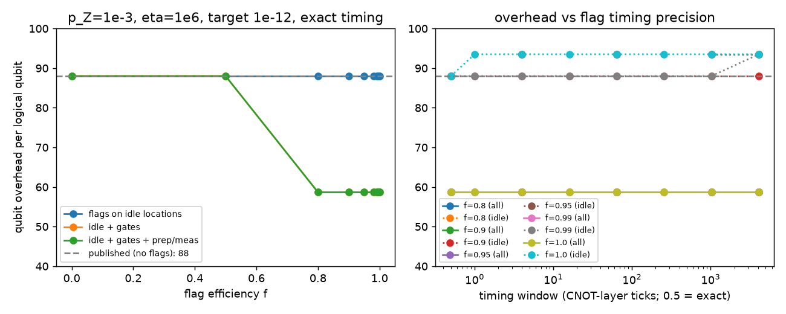
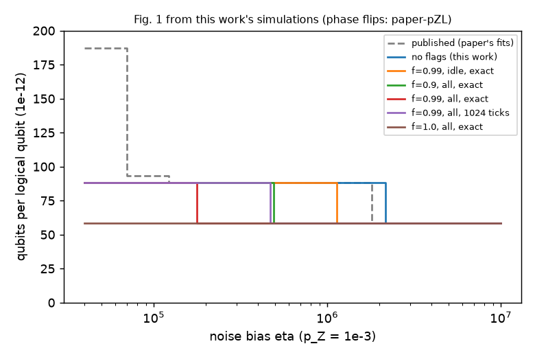
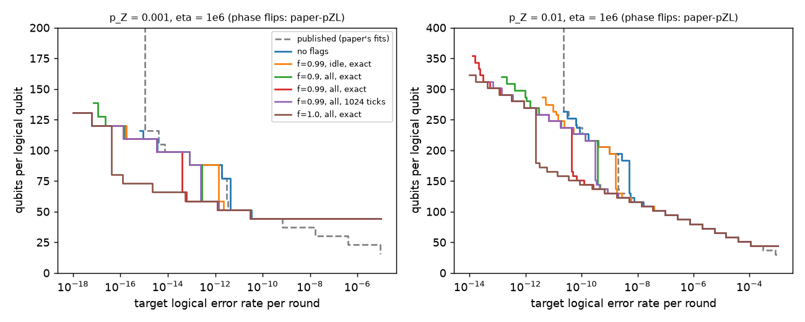

# Flagged bit flips in Elevator-code quantum memories

**Signals that locate bit flips could cut the qubits needed by a third.**
That is the model estimate for the paper's codes at its main noise setting,
when 90% of events are flagged at every stage, including gates, with exact timing.
Whether gates can provide these signals remains open. The source proposal covers
idle qubits only.

Elevator codes use many physical qubits to protect each stored qubit. Signals called
*flags* tell the code where a bit flip may have happened. They do not reveal phase
flips, the other error type in the model.

The plots below use the paper's phase-flip model and assume no false alarms.
They show central estimates, without uncertainty bands. Lower means fewer physical
qubits per protected qubit, called a *logical qubit* in the plots.



Left: flagging gates as well as idle qubits reduces the count from 88 to about 59.
Idle-only flags give no saving here. Right: less precise timing leaves this count
unchanged at this noise setting, although errors can rise. Here, *f* is the fraction
of events flagged; ticks count gate layers. Lines join the tested settings.



Moving right means bit flips are rarer relative to phase flips: this ratio is the
*noise bias*. With less precise timing (purple), the same saving needs rarer bit
flips than with exact timing (red). Timing therefore matters beyond the first plot's
noise setting.



Moving left asks for fewer memory errors; moving up uses more qubits. The right
panel has ten times more physical noise. Flags extend the predicted range of
error targets. These curves include estimates beyond the sizes directly simulated.
At the higher noise level, no tested setting with imprecise timing meets the
target of 10⁻¹² errors per round per protected qubit when the upper uncertainty
bound is used.

Changing the code can help too. An alternative, extended Hamming [16,11,4], gives
a saving even with idle-only flags. False alarms can raise errors even when the
qubit count stays unchanged. The rarest error rates rely on models beyond direct
sampling, and some circuit details remain unresolved in the comparison with the paper.

## Details, reproduction and credits

[Methods](docs/methods.md) explain the assumptions;
[result tables](results/summary/) give the numbers. Code is in [elevator/](elevator/).
From the repository root, regenerate the analysis from saved results with:

```sh
./reproduce.sh analysis
```

Requires Bash and `uv`. On first use, it creates a Python 3.12 environment and
downloads dependencies, including Stim. It rewrites reports, tables and figures.
`RUNNER=local ./reproduce.sh all` also runs checks and simulations, reusing matching
saved results. A fresh run is substantial.

Sources are *Elevator Codes*, *Bit flips are erasures in dissipative cat qubits*,
and *Correlated decoding of logical algorithms with transversal gates*.
[data/README.md](data/README.md) gives links, versions and checksums. The included
code matrices were transcribed from Appendix C of *Elevator Codes*. Papers are
linked, not included; their licences are not recorded here. Code is
[MIT licensed](LICENSE), copyright 2026 Philipp Bogdan.
